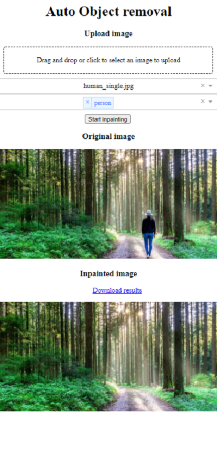
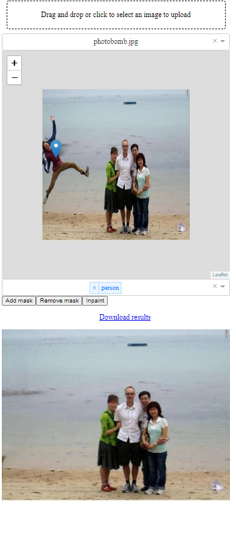

# auto-object-removal
An application to automatically remove selected objects from images.
It combines image segmentation with image inpainting to create automated pipeline to remove whole objects.
There are two removal modes:
* all instance removal (semantic segmentation is used)
* single instance removal (instance segmentation is used) (NOT YET IMPLEMENTED)

Implemented segmentation models:
* Deeplab (torchvision weigths used)

Used image inpainting models:
* CR fill ([this repository](https://github.com/zengxianyu/crfill))

The project is WIP.

# How to use

1. Setup and enter pipenv environment
```bash
pipenv sync
pipenv shell
```

2. Run the program
   1. Semantic segmentation (all instances of selected classes are removed)

```bash
python app.py --mode semseg_img
```
Examples:

|  Image  | Video |
| ----------- | ----------- |
|       |        |


   2. Semantic segmentation (all instances of selected classes are removed)

```bash
python app.py --mode instseg_img
```
Examples:

|  Image  | Video |
| ----------- | ----------- |
|       |        |
